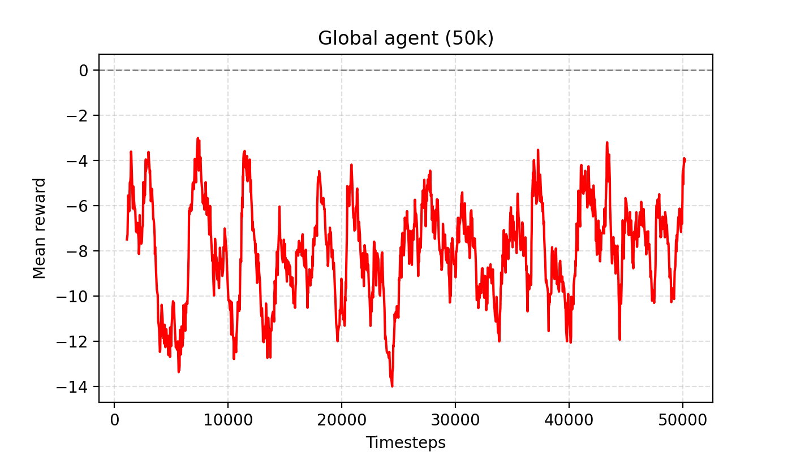
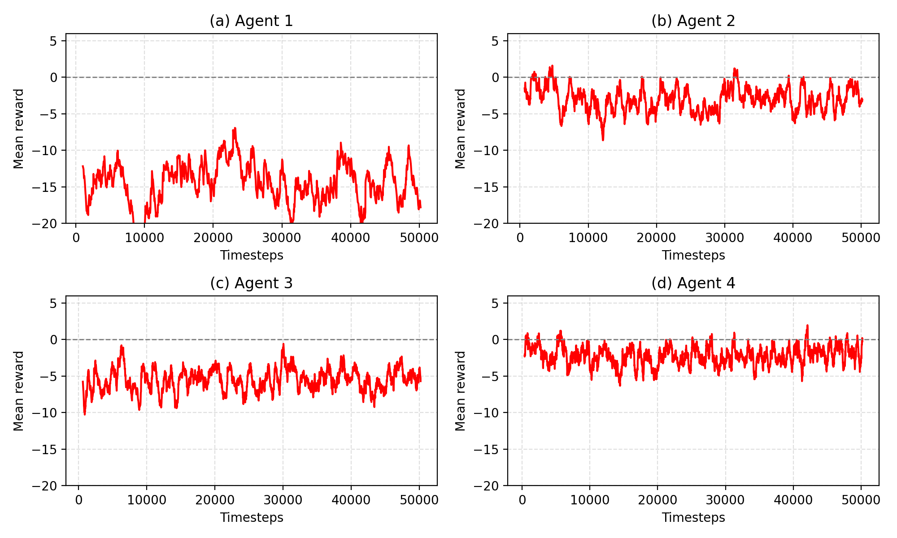

# A Deep Reinforcement Learning Approach for Route Planning of Autonomous Vehicles (PoC)

**Nom :** HIRECHE Zoulikha  
**Simulation :** SUMO + TraCI  
**Données :** Réseau routier de Bari (`bari.net.xml`, `bari.sumocfg`)  

---

## Résumé
Ce projet présente un **Proof of Concept (PoC)** basé sur **Paparella et al. (2024)** [1] pour la planification d’itinéraires de véhicules autonomes par **apprentissage par renforcement profond (DRL)** dans **SUMO**.  
Le problème est modélisé comme un **processus de décision de Markov (MDP)** (états, actions, récompense) et des politiques **PPO** sont entraînées sur le réseau urbain de Bari.  
Nous comparons (i) un **agent global** entraîné sur tout le réseau à (ii) une approche **modulaire** (4 agents entraînés sur 4 zones) combinée via un **manager** (sélection de la meilleure politique par épisode).  
L’évaluation repose sur le **taux de succès**, le **retour moyen**, la **longueur d’épisode** et la stabilité des performances.  
Les résultats obtenus montrent que l’approche **modulaire + manager** peut améliorer la robustesse et la performance par rapport à l’agent global dans notre configuration PoC et avec un budget d’entraînement limité.

> **Note technique (PoC)** : l’article utilise un stack RL différent (souvent Ray/RLlib). Dans ce PoC, nous utilisons **Stable-Baselines3 (PPO)** pour simplifier l’intégration Python/Jupyter et assurer une exécution reproductible. Cette différence peut influencer les temps d’entraînement et certains détails d’implémentation, mais l’objectif de reproduction conceptuelle (MDP, reward, global vs modulaire, manager) reste identique.

---

## 1. Introduction au problème et à sa modélisation
La planification d’itinéraires en milieu urbain vise à déterminer, entre un point de départ et une destination, une séquence d’arêtes du réseau routier optimisant plusieurs critères : **temps de parcours**, **confort/sécurité** (éviter des manœuvres brusques ou des trajectoires incohérentes) et **préférences d’infrastructure** (par exemple des voies “prioritaires” pour véhicules autonomes).  
Paparella et al. (2024) [1] proposent une approche d’**apprentissage par renforcement profond** entraînée dans un simulateur de trafic (SUMO), et introduisent une stratégie **modulaire** : le réseau est partitionné en zones, un agent est entraîné par zone, puis un **manager** choisit la meilleure solution globale.

Dans ce PoC, nous reprenons la structure générale de l’article :
- **MDP** (état/action/récompense),
- entraînement d’agents **PPO**,
- comparaison **global vs modulaire**,
- mécanisme de **manager** pour sélectionner la meilleure route.

Certaines hypothèses sont simplifiées afin de rendre l’entraînement faisable dans le cadre d’un examen (budget de timesteps limité).

---

## 2. Critères d’évaluation d’une solution
Nous évaluons une politique de planification à l’aide des métriques suivantes :

- **Taux de succès (success_rate)** : proportion d’épisodes où le véhicule atteint la destination avant la troncature (limite de pas).  
  $$ SR = \frac{1}{N}\sum_{i=1}^{N}\mathbb{1}(\text{goal\_reached}_i) $$

- **Retour moyen (mean_reward)** : somme des récompenses sur un épisode, moyenne sur plusieurs épisodes.  
  $$ \bar{R} = \frac{1}{N}\sum_{i=1}^{N} R_i $$

- **Longueur moyenne d’épisode (mean_len)** : nombre moyen de décisions/steps par épisode. Une longueur plus faible indique souvent une convergence plus rapide vers le but dans notre paramétrage.

- **Écart-type des retours (std_reward)** : mesure la stabilité/variabilité des performances d’un épisode à l’autre.

Ces critères permettent de comparer quantitativement l’agent global, les agents zonés, et la stratégie modulaire/manager.

---

## 3. Jeu de données de référence et métriques

### 3.1 Données utilisées
Le PoC utilise un réseau routier urbain de Bari converti pour SUMO :
- `bari.net.xml` : graphe routier (arêtes, nœuds, vitesses, géométrie),
- `bari.sumocfg` : configuration de simulation.

Nous filtrons les arêtes conduisibles pour des véhicules “passenger” (arêtes où `allows("passenger")` est vrai).  
**Résultat observé** : ~1240 arêtes passenger (selon le réseau fourni).

### 3.2 Métriques produites sur le dataset
Dans notre exécution :
- **Partition en 4 zones** : quadrants SW/SE/NW/NE par médianes des coordonnées (approximation simple et reproductible).
- **Priority edges** : approximation des voies AV par les **10% d’arêtes les plus rapides** (top 10% speed).

**Hypothèse importante (PoC)** : le dataset OSM/Bari ne fournit pas explicitement des “voies AV”.  
Nous modélisons donc l’ensemble des arêtes prioritaires \(E_p\) comme les **10% d’arêtes avec la plus grande vitesse**.  
Cela approxime l’idée de “priority lanes” de l’article, mais ne correspond pas à une annotation réelle.

---

## 4. Modélisation / résolution + pseudo-code + complexité

### 4.1 Modèle MDP (PoC)
**État** :  
$$ s(t) = [x(t), y(t), \phi(t), e(t)] $$
où \((x,y)\) est la position, \(\phi\) l’angle du véhicule, et \(e\) l’index (ou identifiant) de l’arête courante.

**Actions** :
- `0` : conserver la route actuelle  
- `1` : `rerouteTraveltime()` (SUMO recalcule un itinéraire estimé via temps de trajet)

**Récompense** (forme bornée inspirée de l’article) :
- **progrès** : bonus si le temps estimé vers le but diminue, sinon pénalité,  
- **pénalité de virage** : pénalité si changement d’angle au-delà d’un seuil,  
- **bonus priorité** : bonus si l’arête courante ∈ `priority_edges`,  
- **pénalité par step** + **bonus terminal** en cas d’atteinte du but.

### 4.2 Stratégie modulaire + manager
Nous entraînons 4 agents, chacun limité à une zone. Ensuite, un **manager** exécute des rollouts (ou estimations) et choisit la solution ayant le meilleur retour.

**Pseudo-code :**
```text
Entraîner 1 agent GLOBAL sur tout le réseau.
Partitionner le réseau en 4 zones Z1..Z4.
Entraîner 4 agents A1..A4, un par zone.

Pour évaluer avec MANAGER :
  Pour chaque épisode:
    exécuter une trajectoire avec chaque agent Ai sur sa zone
    obtenir un retour Ri (et succès Si)
    choisir i* = argmax_i Ri
    la solution MANAGER = trajectoire de Ai*
```

## 4.3 Complexité (estimation)
À chaque décision, la simulation peut appeler `findRoute()` et/ou un reroutage.

- **Par épisode :**  
  $$ O(T \cdot C_{route}) $$
  où \(T\) = nombre de décisions (steps) et \(C_{route}\) = coût d’un calcul de route.

- **En entraînement :**  
  $$ O(N \cdot C_{step}) $$
  où \(N\) = total de timesteps et \(C_{step}\) = coût d’une interaction env (TraCI + reward + éventuel routage).

- **Mémoire :** dominée par PPO (réseau MLP) + buffers internes (rollout buffer, normalisation éventuelle, etc.).

---

## 5. Scénarios et cas d’usage reproductibles

### 5.1 Cas d’usage 1 — Agent global
- Entraîner PPO sur toutes les arêtes passenger (`drivable_edges`).  
- Tracer la courbe de reward d’entraînement.  
- Évaluer sur `n_episodes` (start/goal aléatoires).

### 5.2 Cas d’usage 2 — Agents zonés
- Construire les zones (`zones[0..3]`).  
- Entraîner un agent PPO par zone.  
- Tracer 4 courbes (une par agent) de type Fig.5-like.

### 5.3 Cas d’usage 3 — Manager
- Pour un épisode donné, exécuter **4 rollouts** (un par agent zoné).  
- Choisir la solution ayant le **retour maximal**.  
- Mesurer la performance moyenne du manager (`mean_reward`, `success_rate`).

**Limite (Manager)** : dans ce PoC, chaque agent zoné est évalué dans son **sous-réseau**, ce qui peut impliquer des épisodes (start/goal) **non strictement identiques** entre zones. Les résultats du manager doivent donc être interprétés comme une **approximation** (potentiellement optimiste) de la stratégie de sélection.

### 5.4 Instructions de reproduction
- Installer SUMO et définir `SUMO_HOME`.  
- Placer `bari.net.xml` et `bari.sumocfg` dans le dossier `data/`.  
- Exécuter le notebook de code dans l’ordre.  
- Les figures et tableaux sont sauvegardés dans `outputs/`.

---

## 6. Expériences numériques et résultats

### 6.1 Paramètres d’entraînement (exemple)
- Algorithme : **PPO** (Stable-Baselines3).  
- Budget : **50k timesteps** (global) et **50k par zone** (modulaire).  
- Hyperparamètres principaux :  
  - `learning_rate = 2.5e-4`  
  - `n_steps = 512`  
  - `batch_size = 64`  
- Décisions : toutes les `decision_interval` secondes, maximum `max_decisions` par épisode.

### 6.2 Résultats (figures et tables)

#### Figures
- Courbe d’entraînement global : `outputs/global_50k.png`  
- Courbes zonées : `outputs/fig5_like_modular_50k.png`

Exemple d’insertion d’images dans GitHub :
  


#### Tables (issues du notebook)
- Évaluation **GLOBAL + ZONES** : `mean_reward`, `std_reward`, `mean_len`, `success_rate`  
- Évaluation **MANAGER + résumé** : `mean_reward`, `success_rate`, `zone_counts`  

---

## 7. Analyse des expériences + limites + reproductibilité

### 7.1 Analyse
Dans nos résultats (50k timesteps), l’agent **Global** atteint environ :
- \( \text{mean\_reward} \approx -3.38 \)
- \( \text{success\_rate} \approx 0.43 \)

La stratégie **Modulaire + Manager** atteint :
- \( \text{mean\_reward} \approx +6.04 \)
- \( \text{success\_rate} \approx 0.87 \)

Ces résultats vont dans le sens de la conclusion de l’article [1] : la décomposition en zones peut réduire la complexité de décision et améliorer la robustesse et/ou la convergence **dans certaines configurations** (dépendantes du réseau, du trafic, et de la reward).

### 7.2 Limites et hypothèses
- **Priority edges** : approximation par top 10% vitesse (≠ voie AV réelle).  
- **Action space** : action simplifiée (`rerouteTraveltime`) ≠ choix explicite gauche/droite/tout droit aux intersections comme dans l’article.  
- **Budget d’entraînement** : 50k timesteps (PoC) ≠ entraînement plus long (paper).  
- **Trafic / configuration** : la configuration SUMO influence fortement la difficulté des épisodes.  
- **Manager** : sélection “best return” dans un cadre PoC (voir remarque section 5.3).
- Dans ce PoC, le manager choisit le meilleur retour parmi 4 évaluations faites sur des sous-réseaux; ce n’est pas une hiérarchie exacte comme dans l’article, mais une approximation de la sélection de politique.

### 7.3 Retour sur la publication (reproductibilité)
L’article fournit la structure générale (MDP, reward, PPO, approche modulaire), mais certains éléments peuvent manquer pour reproduire à l’identique :
- paramètres exacts de génération start/goal,  
- trafic exact et configuration SUMO,  
- détails d’annotation des voies prioritaires,  
- seeds et variations de simulation.

Notre PoC documente explicitement les hypothèses prises et fournit un pipeline reproductible dans le cadre de l’examen.

---

## 8. Références
[1] Paparella et al., 2024 — *A Deep Reinforcement Learning Approach for Route Planning of Autonomous Vehicles*.  
[2] Documentation SUMO / TraCI.   
[3] OpenStreetMap (données Bari).
